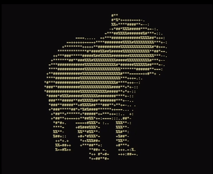

# Capture The Flag submission for Reverse Engineering

> Developed by Manuel Wirth, Romeo Türemis and Yan Wittmann.

As a part of the Reverse Engineering module at the Hochschule Mannheim,
we were tasked with creating a custom Capture The Flag (CTF) challenge for our fellow students to solve.
The challenge was to create a C binary that would only output a flag in the form of `FLAG{...}` when the correct input
was given.
The challenge could be almost anything, such as exploiting vulnerabilities, reverse engineering algorithms, or finding
the correct sequence of inputs to traverse an algorithm.

Inspired by our Professor's love of Capybaras, we decided to create a challenge that integrates the animal into the CTF.
We challenge you to crack our CTF and find the flag yourself!

## Build

A pre-built binary is included as part of the repository at [crackme](crackme).
To build the `crackme` yourself, simply run the following command in the root directory of the project:

```bash
make
```

## Solution

If you need a hint or want to see the solution, you can find it in the [solution.md](solution/solution.md) document.
It's written in german, but the calculations and steps should be understandable.
Otherwise, use a translator of your choice.



## License

This project and all it's files are licensed under the Apache License 2.0.
You can find the license in the [LICENSE](LICENSE) file.

## Acknowledgements

See [acknowledgements.md](res/acknowledgements.md).
