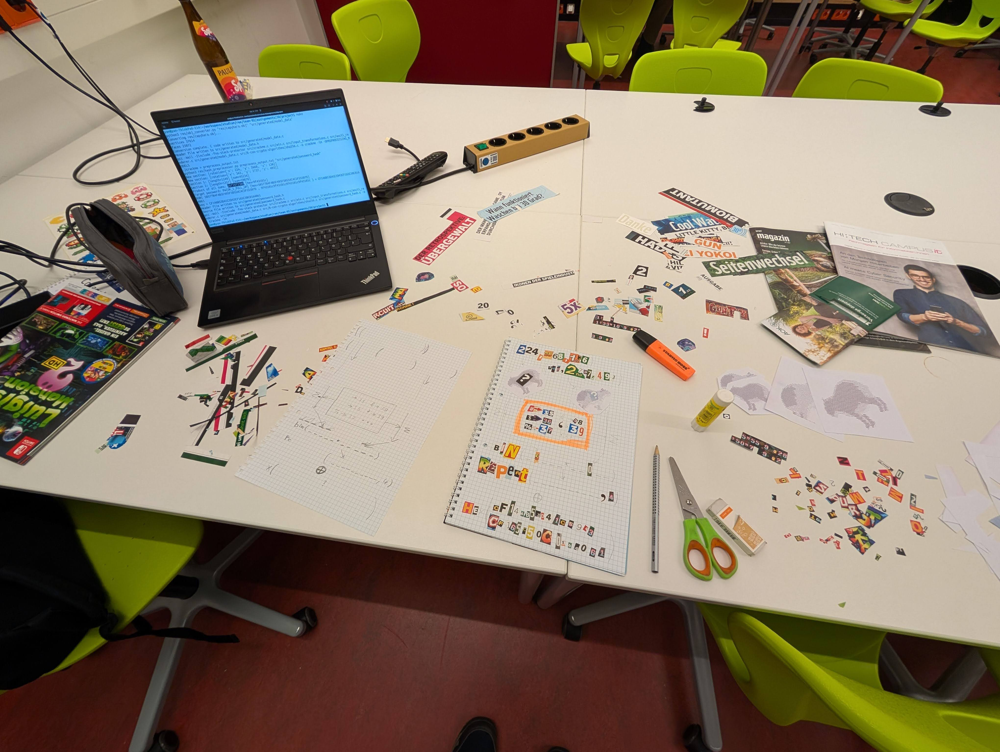
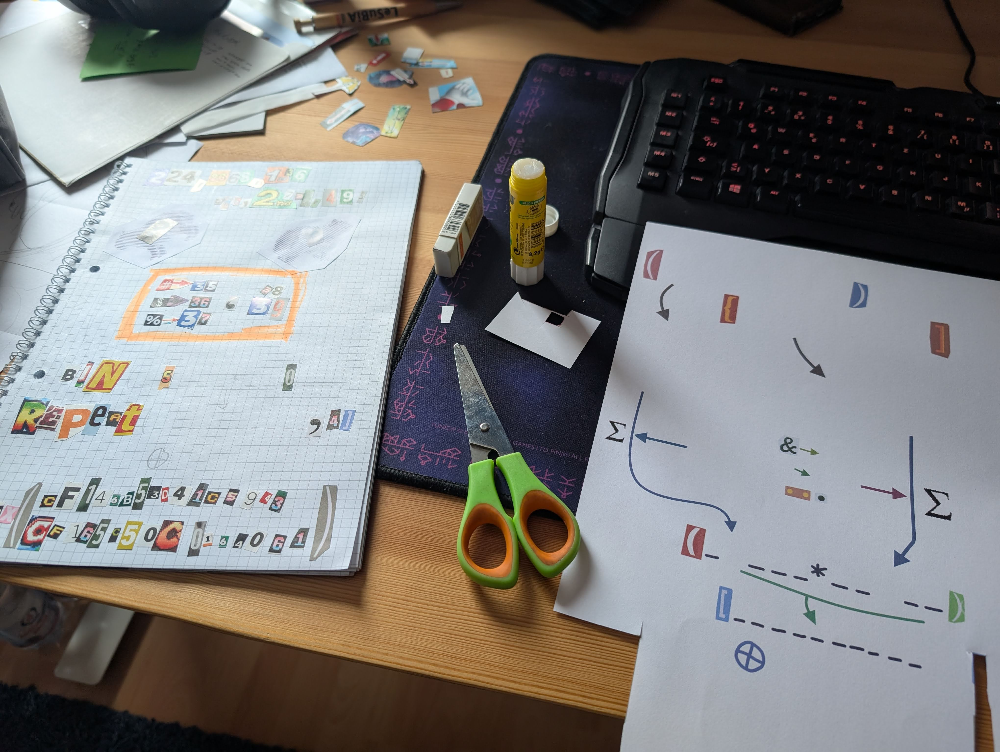
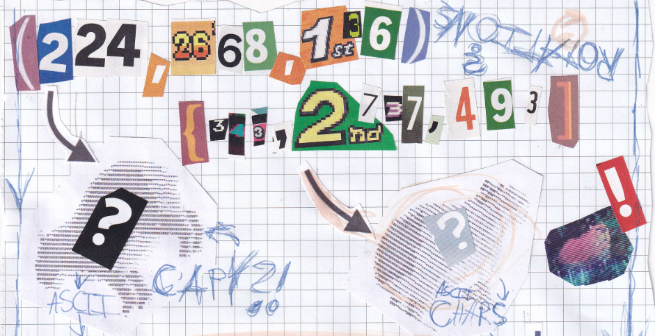
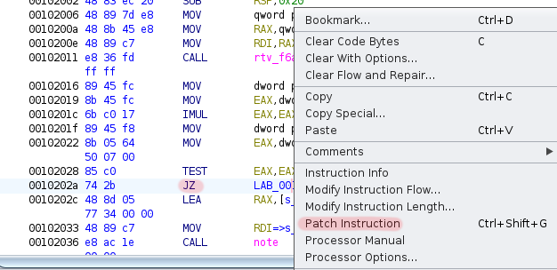
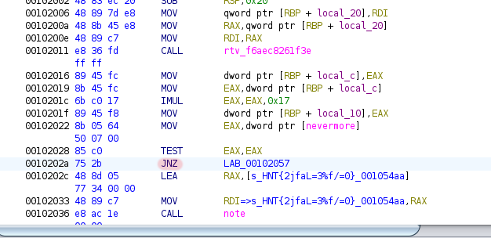
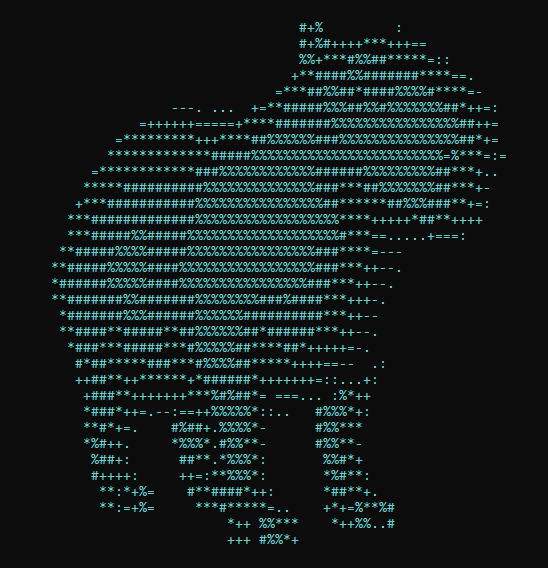
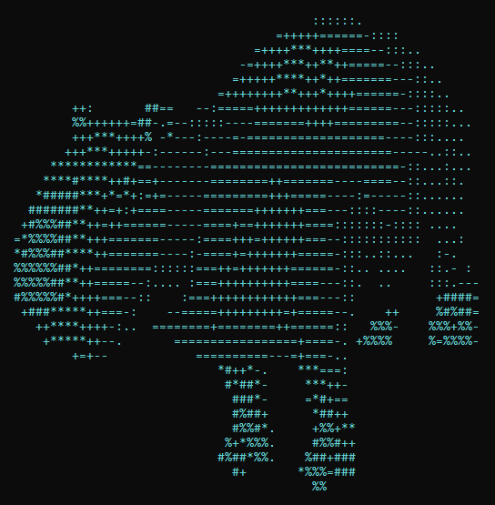

# Team FCK_202c Assignment 30 CTF Solution

> Dieses Dokument enthält die Lösung für das CTF crackme von Team FCK_202c. (the capybara experience)

<!-- TOC @formatter:off -->
* [Team FCK_202c Assignment 30 CTF Solution](#team-fck_202c-assignment-30-ctf-solution)
  * [Bauen des Projekts](#bauen-des-projekts)
  * [Automatischer Solver](#automatischer-solver)
  * [Lösung des CTFs](#lösung-des-ctfs)
    * [Schritt 1: Finden der eingebettenen PDF-Datei](#schritt-1-finden-der-eingebettenen-pdf-datei)
    * [Schritt 2: Rotationswerte finden](#schritt-2-rotationswerte-finden)
    * [Schritt 3: Verstehen der Rotationsberechnung (input transformation)](#schritt-3-verstehen-der-rotationsberechnung-input-transformation)
      * [X-Achse](#x-achse)
      * [Y-Achse](#y-achse)
      * [Z-Achse](#z-achse)
    * [Schritt 4: Aktivieren von Debug-Outputs](#schritt-4-aktivieren-von-debug-outputs)
    * [Schritt 5: Berechnung der Inputs für die Rotationswerte](#schritt-5-berechnung-der-inputs-für-die-rotationswerte)
      * [Rotation 1: `(224, 2668, 136)`](#rotation-1-224-2668-136)
      * [Rotation 2: `(343, 2737, 493)`](#rotation-2-343-2737-493)
    * [Schritt 6: Summieren der ASCII-Werte](#schritt-6-summieren-der-ascii-werte)
    * [Schritt 7: Berechnung des Passworts](#schritt-7-berechnung-des-passworts)
    * [Schritt 8: Eingabe des Passworts](#schritt-8-eingabe-des-passworts)
  * [Hinweissystem](#hinweissystem)
      * [ransom note meta data](#ransom-note-meta-data)
<!-- TOC @formatter:on -->

<details>
<summary>Einige Bilder, wie wir den Hinweis/Erpresserbrief gestaltet haben</summary>





</details>

## Bauen des Projekts

Auf der Ordnerebene über diesem Dokument (`project`) muss einfach mit `make` das Projekt gebaut werden:

```bash
make clean all
```

## Automatischer Solver

Mit diesem Skript kann im projektordner das CTF automatisch gelöst werden:

```bash
$ python3 solution/solver.py ./crackme "\x61\x65\x69\x6F\x75\x79\x79\x79\x79\x39\x02\x05" "\x75\x61\x61\x61\x61\x61\x62\x33\x20\x01\x01\x01\x01"
Running crackme with payload 1: \x61\x65\x69\x6F\x75\x79\x79\x79\x79\x39\x02\x05, aeiouyyyy9
char count:  {':': 124, '.': 84, '=': 359, '+': 231, '-': 157, '*': 98, '#': 71, '%': 68}
Payload 1 ASCII Sum: 59070

Running crackme with payload 2: \x75\x61\x61\x61\x61\x61\x62\x33\x20\x01\x01\x01\x01, uaaaaab3 
char count:  {'#': 296, '+': 116, '%': 332, ':': 25, '*': 249, '=': 47, '.': 37, '-': 25}
Payload 2 ASCII Sum: 45234
Product of ASCII Sums: 2671972380
Product in binary: 10011111010000110001000000011100
Repeated 4 times: 10011111010000110001000000011100100111110100001100010000000111001001111101000011000100000001110010011111010000110001000000011100
Hex key: b'\xcf\x14kS\xd4\x1cYC\xcf\x16\\P\xc0\x16@a'
XOR Result: PW{OK_I_PULL_UP}
FLAG: FLAG{capybara_based_encryption}
```

## Lösung des CTFs

Dieses Write-Up ist sehr detailliert, darum ist es so lang.
Zur besseren Übersichtlichkeit wurde es in mehrere Schritte unterteilt.

### Schritt 1: Finden der eingebettenen PDF-Datei

Über diverse Hinweise kann man darauf kommen, dass die ausführbare Datei eine eingebettete PDF-Datei enthält.

- über `strings` können diverse PDF-typische Strings gefunden werden.
- wenn ein falsches Passwort eingegeben wird, wird der String
  `To comprehend its binary dance, walk the hidden path, peek yet deeper inside.`
  ausgegeben, was auf `binwalk` hinweist.
- die Hinweise `[A] capybara compensation` und `[B] capybara compensation` haben ähnliche, etwas deutlichere Hinweise.

Also, man kann die eingebettete PDF-Datei mit `binwalk` extrahieren:

```bash
$ binwalk --dd='.*' crackme
$ file _crackme.extracted/*
_crackme.extracted/0:     ELF 64-bit LSB pie executable, x86-64, version 1 (SYSV), dynamically linked, interpreter /lib64/ld-linux-x86-64.so.2, BuildID[sha1]=52c1abc51785da54390573375db842d8862f2c14, for GNU/Linux 3.2.0, not stripped
_crackme.extracted/74540: OpenPGP Public Key
_crackme.extracted/77F70: PDF document, version 1.3
_crackme.extracted/780A0: JPEG image data, JFIF standard 1.01, resolution (DPI), density 300x300, segment length 16, Exif Standard: [TIFF image data, big-endian, direntries=9, manufacturer=Canon, model=MM, xresolution=128, yresolution=136, resolutionunit=2, software=MM, datetime=2024:12:24 11:42:55], baseline, precision 8, 71x106, components 3
_crackme.extracted/780BE: TIFF image data, big-endian, direntries=9, manufacturer=Canon, model=MM, xresolution=128, yresolution=136, resolutionunit=2, software=MM, datetime=2024:12:24 11:42:55
_crackme.extracted/7B879: JPEG image data, JFIF standard 1.01, resolution (DPI), density 300x300, segment length 16, baseline, precision 8, 2356x3504, components 3
```

Man erhält diese PDF-Datei: [capy_ransom.pdf](../res/capy_ransom.pdf),
welche die Hinweise für die nächsten Schritte enthält.

### Schritt 2: Rotationswerte finden

Auch hier gibt es wieder Hinweise, die auf die Bearbeitungsreihenfolge des PDFs hinweisen.

- die Pfeilrichtungen der Datenflüsse zeigen alle von oben nach unten.
- an den Seiten links und rechts sind Pfeile von oben nach unten.
- es gibt einen Hinweis `ransom note meta data`, der wesentlich klarere Instruktionen für einige der Schritte gibt.

Wir müssen also von oben nach unten anfangen.
Nehmen wir einen Blick auf den ersten Teil im PDF:



Der erste Schritt ist zu verstehen, dass man die Rotation des 3D-Capybaras im Programm durch die eigene Eingabe
manipulieren kann.
Dies ist recht einfach festzustellen, denn der User-Input wird an eine Methode
`compensation_capybara(const char *input)`
weitergegeben, die dann mit drei Methoden `compute_rotation_x(input)` etc. die Rotationen berechnet,
die an das 3D-Modell des Capybaras angewendet werden.
Die individuellen Berechnungsmethoden werden wir nachher genauer betrachten.

Aus dem PDF (und auch später aus einem weiteren Text der ausgegeben werden wird) erfahren wir,
dass zwei unterschiedliche Rotationen nötig sind.
Die entsprechenden Rotationswerte sind aus Zeitungsbuchstaben und Zahlen zusammengesetzt:

- `(224, 2668, 136)`
- `(343, 2737, 493)`

### Schritt 3: Verstehen der Rotationsberechnung (input transformation)

Sehen wir uns die Methoden `compute_rotation_x`, `compute_rotation_y` und `compute_rotation_z` genauer an.
Diese sehen auf den ersten Blick abschreckend und kompliziert aus, man muss sich aber einfach nur durch die
Methoden durcharbeiten und die Bedingungen der Berechnungen verstehen.

#### X-Achse

In `rtv_1a7c5f9e3b02` wird die Anzahl der gesetzten Bits in den Bytes des Inputs gezählt.
Also "die Einsen im Input".

Dieser Wert wird dann mit 7 multipliziert und als Rotation für die X-Achse verwendet.

```c
uint compute_rotation_x(undefined8 param_1) {
  uint uVar1 = rtv_1a7c5f9e3b02(param_1);
  if (nevermore != 0) {
    printf("[x] base: %d, scaled: %d\n",(ulong)uVar1,(ulong)(uVar1 * 7));
  }
  return uVar1 * 7;
}

int rtv_1a7c5f9e3b02(long param_1) {
  undefined local_19;
  undefined8 local_18;
  undefined4 local_c;

  local_c = 0;
  for (local_18 = 0; *(char *)(local_18 + param_1) != '\0'; local_18 = local_18 + 1) {
    for (local_19 = *(byte *)(local_18 + param_1); local_19 != 0; local_19 = local_19 >> 1) {
      local_c = local_c + (local_19 & 1);
    }
  }
  return local_c;
}
```

#### Y-Achse

In `rtv_f6aec8261f3e` wird die absolute Differenz zwischen dem kleinsten und größten Byte im Input berechnet,
also die Character Range des Inputs.
Ein Beispiel, wenn der Input "Abc" ist, dann ist die Differenz `34` (c - A = 99 - 65 = 34).

Dieser Wert wird dann mit `0x17` = `23` multipliziert und als Rotation für die Y-Achse verwendet.

```c
uint compute_rotation_y(undefined8 param_1) {
  uint uVar1 = rtv_f6aec8261f3e(param_1);
  if (nevermore != 0) {
    printf("[y] base: %d, scaled: %d\n",(ulong)uVar1,(ulong)(uVar1 * 0x17));
  }
  return uVar1 * 0x17;
}

int rtv_f6aec8261f3e(byte *param_1) {
  byte bVar1;
  int iVar2;
  long local_18;
  byte local_a;
  byte local_9;
  
  note("HNT{17d026b94253}");
  
  if (*param_1 == 0) {
    iVar2 = 0;
  } else {
    local_a = *param_1;
    local_9 = local_a;
    for (local_18 = 1; param_1[local_18] != 0; local_18 = local_18 + 1) {
      bVar1 = param_1[local_18];
      if (bVar1 < local_9) {
        local_9 = bVar1;
      }
      if (local_a < bVar1) {
        local_a = bVar1;
      }
    }
    if (nevermore != 0) {
      printf("%u - %u\n",(ulong)local_9,(ulong)local_a);
    }
    iVar2 = (uint)local_a - (uint)local_9;
  }
  return iVar2;
}
```

#### Z-Achse

Definitiv die umständlichste Methode ist `compute_rotation_z`.
Aber sobald man einmal die Auflistung der Vokale gesehen hat, sind die restlichen gar nicht mehr so schlimm.

- `rtv_5fde1cd1e0bc` zählt die Vokale im Input (`aeiouAEIOU`).
- `rtv_ba45be1c9d61` zählt die Konsonanten im Input.
- `rtv_c78fa75633ce` summiert die Werte der Zahlen im Input (`123` → 1 + 2 + 3 = 6).

Hier gibt es eine Bedingung `((iVar1 < 5) || (iVar2 < 1)) || (iVar3 < 1)`, die besagt,
dass wenn die Anzahl der Vokale kleiner als 5, die Anzahl der Konsonanten kleiner als 1
oder die Summe der Zahlen kleiner als 1 ist, dann wird eine zufällige Rotation verwendet.
Dies wollen wir natürlich nicht, also muss der Input so gewählt werden, dass diese Bedingung nicht erfüllt ist.

Die Rotation für die z-Achse wird dann wie folgt berechnet: `rotation_z = (summe_zahlen + anzahl_konsonanten * 5) * 17`.

```c
uint compute_rotation_z(undefined8 param_1) {
  int iVar1;
  int iVar2;
  int iVar3;
  uint local_c;
  
  iVar1 = rtv_5fde1cd1e0bc(param_1);
  iVar2 = rtv_ba45be1c9d61(param_1);
  iVar3 = rtv_c78fa75633ce(param_1);
  if (((iVar1 < 5) || (iVar2 < 1)) || (iVar3 < 1)) {
    local_c = random_between(0xffffffd3,0x2d);
  } else {
    local_c = iVar3 + iVar2 * 5;
  }
  if (nevermore != 0) {
    note("HNT{2jfaL=3%f/=0}");
    printf("[z] base: %d, scaled: %d\n",(ulong)local_c,(ulong)(local_c * 0x11));
  }
  return local_c * 0x11;
}

int rtv_5fde1cd1e0bc(long param_1) {
  char cVar1;
  undefined8 local_18;
  undefined4 local_c = 0;

  for (local_18 = 0; *(char *)(local_18 + param_1) != '\0'; local_18 = local_18 + 1) {
    cVar1 = *(char *)(local_18 + param_1);
    if ((((((cVar1 == 'a') || (cVar1 == 'e')) || (cVar1 == 'i')) ||
         ((cVar1 == 'o' || (cVar1 == 'u')))) ||
        ((cVar1 == 'A' || ((cVar1 == 'E' || (cVar1 == 'I')))))) ||
       ((cVar1 == 'O' || (cVar1 == 'U')))) {
      local_c = local_c + 1;
    }
  }
  return local_c;
}

int rtv_ba45be1c9d61(long param_1) {
  char cVar1;
  undefined8 local_18;
  undefined4 local_c = 0;

  for (local_18 = 0; *(char *)(local_18 + param_1) != '\0'; local_18 = local_18 + 1) {
    cVar1 = *(char *)(local_18 + param_1);
    if ((((('`' < cVar1) && (cVar1 < '{')) || (('@' < cVar1 && (cVar1 < '[')))) &&
        ((((((cVar1 != 'a' && (cVar1 != 'e')) && (cVar1 != 'i')) &&
           ((cVar1 != 'o' && (cVar1 != 'u')))) && (cVar1 != 'A')) &&
         ((cVar1 != 'E' && (cVar1 != 'I')))))) && ((cVar1 != 'O' && (cVar1 != 'U')))) {
      local_c = local_c + 1;
    }
  }
  return local_c;
}


int rtv_c78fa75633ce(long param_1) {
  undefined8 local_18;
  undefined4 local_c = 0;

  for (local_18 = 0; *(char *)(local_18 + param_1) != '\0'; local_18 = local_18 + 1) {
    if (('/' < *(char *)(local_18 + param_1)) && (*(char *)(local_18 + param_1) < ':')) {
      local_c = local_c + *(char *)(local_18 + param_1) + -0x30;
    }
  }
  return local_c;
}
```

### Schritt 4: Aktivieren von Debug-Outputs

Nun müssen wir die Inputs für die Berechnung der beiden Rotationen erstellen.
Am einfachsten ist es, wenn die Methode aus dem Hinweis `sd_chr_spc_dpth` verwendet wird: `echo -ne '\x65' | ./crackme`.
So können recht einfach beliebige ASCII-Zeichen eingegeben werden, auch non-printable.

Allerdings wäre es schon sehr aufwendig, die einzelnen Rotationswerte jedes Mal mit `gdb` zu überprüfen oder
davon auszugehen, dass man immer richtig liegt.
Darum gibt es im Programm vorgefertigte Bedingungen, die standardmäßig immer falsch sind, die einem aber die
Rotationswerte einfach ausgeben können, wenn man sie aktivieren würde:

```c
if (nevermore != 0) {
  printf("[z] base: %d, scaled: %d\n",(ulong)local_c,(ulong)(local_c * 0x11));
}
```

Das kann man natürlich über Ghidra machen: Auf die `JZ`-Instruktion rechtsklicken und "Patch Instruction" auswählen.
Dann diese durch eine `JNZ` oder `NOP` ersetzen.
Wenn nun das Programm wieder abgespeichert wird,
wird die Bedingung immer erfüllt sein und die Rotationswerte ausgegeben.





Nun können wir richtig loslegen, die Inputs zu bestimmen.

### Schritt 5: Berechnung der Inputs für die Rotationswerte

Die Regeln noch einmal zusammengefasst:

| Achse | Faktor | Regel                                                  | Weiteres                                        |
|-------|--------|--------------------------------------------------------|-------------------------------------------------|
| x     | 7      | Anzahl der gesetzten Bits im Input                     |                                                 |
| y     | 23     | Differenz zwischen kleinstem und größtem Byte im Input |                                                 |
| z     | 17     | Vokale + Konsonanten \* 5                              | mind. 5 Vokale, mind. 1 Konsonant, mind. 1 Zahl |

Persönlich finden wir es am einfachsten, hinten mit z anzufangen und dann mit y fortzufahren und zuletzt x zu machen.
Einfach, weil die Bedingungen so herum immer weniger restriktiv werden und es einfacher ist, um sie herumzuarbeiten.
Ein Hinweis `[x] axis` gibt auch einen Hinweis auf diese Reihenfolge.

#### Rotation 1: `(224, 2668, 136)`

Wenden wir zunächst die Skalierungsfaktoren umgekehrt an:

- x: `224 / 7 = 32`
- y: `2668 / 23 = 116`
- z: `136 / 17 = 8`

| Achse | Input                  | x       | y         | z      | Notizen                                                                                                                                                                       |
|-------|------------------------|---------|-----------|--------|-------------------------------------------------------------------------------------------------------------------------------------------------------------------------------|
| z     | `K1aaaaa`              | 22, 154 | 48, 1104  | 6, 102 | Mindestens 1 Konsonant, 5 Vokale und eine Zahl                                                                                                                                |
| z     | `K1aaaaa2`             | 25, 175 | 48, 1104  | 8, 136 | Um z auf 8 zu bringen, fügen wir eine 2 hinzu, die einfach auf die Summe addiert wird                                                                                         |
| y     | `K1aaaaa2\x01\x75`     | 31, 217 | 116, 2668 | 8, 136 | Die Zeichentiefe in y kann einfach durch eine Range von x01 bis x75 erreicht werden. Auf diese Weise haben wir auch genügend Zeichen zur Verfügung um x einfach zu erreichen. |
| x     | `K1aaaaa2\x01\x75\x01` | 32, 224 | 116, 2668 | 8, 136 | Da nur noch 1 Bit gesetzt werden muss (ist bereits 31, nur noch 1 fehlt), kann das einfach durch ein weiteres x01 erreicht werden.                                            |

Wenn wir das machen, erhalten wir das erste Capybara:

<details>
<summary>Zeichenfolge</summary>
<code>
 .-------------------------------------------------------------------------------------------.
 | The capybara awakens, its movements now aligned with the cosmic dance of the void.        |
 | The forgotten creature acknowledges your mastery over the unseen forces that guide it.    |
 | But one capybara alone cannot complete the dance - its twin must also align.              |
 | Sum their essence, multiply their bond, and break the cipher to unlock the path.          |
 '-------------------------------------------------------------------------------------------'

=== v v v v v v v capy bounds v v v v v v v ===

                                                 #+%         :
                                                 #+%#++++***+++==
                                                 %%+***#%%##*****=::
                                                +**####%%#######****==.
                                              =***##%%##*####%%%%#****=-
                                 ---. ...  +=**#####%%%##%%#%%%%%%%##*++=:
                             =++++++=====+****#######%%%%%%%%%%%%%%%%##++=
                          =*********+++****##%%%%%%###%%%%%%%%%%%%%%%##*+=
                         *************#####%%%%%%%%%%%%%%%%%%%%%%%%=%***=:=
                       =************###%%%%%%%%%%%%######%%%%%%%%%##***+..
                      *****##########%%%%%%%%%%%%%%###***##%%%%%%%##***+-
                     +***###########%%%%%%%%%%%%%%%%##******##%%%###**+=:
                    ***#############%%%%%%%%%%%%%%%%%%****+++++*##**++++
                    ***#####%%#####%%%%%%%%%%%%%%%%%%%#***==.....+===:
                   **#####%%%%#####%%%%%%%%%%%%%%%%###****=---
                  **#####%%%%%####%%%%%%%%%%%%%%%%%###***++--.
                  *######%%%%%####%%%%%%%%%%%%%%%%###***++--.
                  **#######%%#######%%%%%%%%###%####***+++-.
                   *#######%%%######%%%%%%##########***++--
                   **####**#####**##%%%%%%##*######***++--.
                    *###***#####***#%%%%%##****##*+++++=-.
                     #*##*****###***#%%%%##*****++++==--  .:
                     ++##**++******+*######*+++++++=::...+:
                      +###**+++++++***%#%##*= ===... :%*++
                      *###*++=.--:==++%%%%%*::..   #%%%*+:
                      **#*+=.    #%##+.%%%%*-      #%%***
                      *%#++.     *%%%*.#%%**-      #%%**-
                       %##+:      ##**.*%%%*:       %%#*+
                       #++++:     ++=:**%%%*:       *%#**:
                        **:*+%=    #**####*++:      *##**+.
                        **:=+%=     ***#*****=..    +*+=%**%#
                                        *++ %%***    *++%%..#
                                        +++ #%%*+

=== ^ ^ ^ ^ ^ ^ ^ capy bounds ^ ^ ^ ^ ^ ^ ^ ===
</code>
</details>



#### Rotation 2: `(343, 2737, 493)`

- x: `343 / 7 = 49`
- y: `2737 / 23 = 119`
- z: `493 / 17 = 29`

| Achse | Input                    | x       | y         | z       | Notizen                                                  |
|-------|--------------------------|---------|-----------|---------|----------------------------------------------------------|
| z     | `K1aaaaa`                | 22, 154 | 48, 1104  | 6, 102  | Mindestens 1 Konsonant, 5 Vokale und eine Zahl           |
| z     | `K1aaaaa995`             | 34, 238 | 48, 1104  | 29, 493 | Um auf die 29 zu kommen brauchen wir noch 23, also 9+9+5 |
| y     | `K1aaaaa995\x07\x7E`     | 39, 273 | 119, 2737 | 34, 578 | Eine Range von x07 bis x7E für y                         |
| x     | `K1aaaaa995\x07\x7E\x7E` | 49, 343 | 119, 2737 | 34, 578 | 6 Bits fehlen noch für x, also einfach noch ein x7E      |

Wenn wir das machen, erhalten wir das zweite Capybara:

<details>
<summary>Zeichenfolge</summary>
<code>
 .-------------------------------------------------------------------------------------------.
 | The capybara awakens, its movements now aligned with the cosmic dance of the void.        |
 | The forgotten creature acknowledges your mastery over the unseen forces that guide it.    |
 | But one capybara alone cannot complete the dance - its twin must also align.              |
 | Sum their essence, multiply their bond, and break the cipher to unlock the path.          |
 '-------------------------------------------------------------------------------------------'

=== v v v v v v v capy bounds v v v v v v v ===

                                                 ::::::.
                                            =+++++======-::::
                                         =++++***++++====--:::..
                                       -=++++***++**++=====--:::..
                                      =+++++****++*++=======---::..
                                    =++++++++**+++*++++======-::::..
                ++:       ##==   --:=====+++++++++++++======---:::::..
                %%++++++=##-.=--:::::----=======++++=========--:::::...
                +++***++++% -*---:----=-===================----:::....
               +++***+++++-:------:---======================-----..::..
             ************==--------==========================-::...:...
            ****#****++#+==+-------========++=======----====--::...::.
           *#####***+*=*+:=+=-----=========+++=====----:=-----::......
          #######**++=+:+====-----=======+++++++===---::::----::......
         +#%%%##**++=++======-----====+==+++++++====:::::::-:::: ....
        =*%%%%##**+++=======-----:====+++=++++++===--:::::::::::  ...:
        *#%%%##****++=======----:-====+=+++++++=====-:::..::...   :-.
        %%%%%%##*++========::::::===++=+++++++======-::.. ....   ::.- :
        %%%%%##**++=====--:.... :===++++++++++====---::.  ..     :::.---
        #%%%%%#*++++===--::    :===++++++++++++===---::           +####=
         +###*****++===-:    --=====+++++++++=+=====--.    ++     %#%##=
           ++****++++-:..  ========+========++======::   %%%-    %%%+%%-
            +*****++--.       =================+====-. +%%%%     %=%%%%-
                +=+--            ==========---=+===-..
                                    *#++*-.    ***===:
                                     #*##*-     ***++-
                                      ###*-     =*#+==
                                      #%##+      *##++
                                      #%%#*.     +%%+**
                                     %+*%%%.     #%%#++
                                    #%##*%%.    %##+###
                                      #+       *%%%=###
                                                 %%

=== ^ ^ ^ ^ ^ ^ ^ capy bounds ^ ^ ^ ^ ^ ^ ^ ===
</code>
</details>



### Schritt 6: Summieren der ASCII-Werte


Der nächste Schritt lässt sich wieder aus dem PDF ableiten.
In der Mitte müssen die Zeichen und Zahlen als ASCII-Tabelle interpretiert werden.
Links und rechts außen sind Summenzeichen abgebildet, die mit den Abbildungen der Capybaras und den ASCII-Werten
mit Pfeilen verbunden sind.
Zwischen dem Summenzeichen und den Abbildungen ist außerdem der Text `ASCII` und `CHARS` zu sehen, noch ein Hinweis
darauf, dass die ASCII-Werte genommen werden müssen.

Dass keine spaces oder newlines gezählt werden sollen, erhält man aus dem kleinen Text über der Box,
oder aus dem Hinweis `ransom note meta data`.

Dies lässt sich einfach mit einem Python-Skript lösen:

```python
input_str = "..."  # capybara input
print(sum(ord(char) for char in input_str if char != ' ' and char != '\n'))
```

So erhält man die beiden Summen `45234` und `59070`.
Zur Selbstkontrolle der Spieler sind jeweils eine Ziffer der beiden Zahlen in den Platzhaltern ausgefüllt.
Ansonsten wäre hier ein zu langer Schritt ohne Feedback, dass man auf der richtigen/falschen Spur ist.

### Schritt 7: Berechnung des Passworts


Nun haben wir die beiden Summen `45234` und `59070`.
Im PDF sind diese als 5-stellige Zahlen dargestellt, mit einer Stelle pro Zahl jeweils ausgefüllt um es den Spielern
einfacher zu machen und eine Kontrollmöglichkeit zu geben.

Zwischen den Zahlen im PDF ist ein Multiplikationszeichen `*` abgebildet,
die Zahlen müssen also multipliziert werden: `45234 * 59070 = 2671972380`.

Das Produkt ist in einer [Funktion `bin`](https://yanwittmann.de/projects/tools/base-converter.html) gewrappt:
`bin(2671972380) = 10011111010000110001000000011100`.

Dann wird eine Funktion `repeat(10011111010000110001000000011100, 4)` aufgerufen, die den String 4-mal wiederholt:
`10011111010000110001000000011100100111110100001100010000000111001001111101000011000100000001110010011111010000110001000000011100`.

Dieser String muss dann mit einem [XOR](https://yanwittmann.de/projects/tools/xor-convert.html)
gegen `CF146B53D41C5943CF165C50C0164061` gerechnet werden:
`10011111010000110001000000011100100111110100001100010000000111001001111101000011000100000001110010011111010000110001000000011100 XOR CF146B53D41C5943CF165C50C0164061 = PW{OK_I_PULL_UP}`.

### Schritt 8: Eingabe des Passworts

Das Passwort `PW{OK_I_PULL_UP}` wird nun in das Programm eingegeben.
Es erscheint ein goldenes, rotierendes Capybara und die Flag wird ausgegeben:

```
FLAG{capybara_based_encryption}
```

## Hinweissystem

Um es für die Teilnemher einfacher zu gestalten, wurde ein Hinweissystem implementiert.
Siehe [hint_system_generator.py](../res/hint_system_generator.py) für alle Hinweise.
Schlüssel für die Hinweise sind überall im Code und in den Daten versteckt und können über eine Eingabe in das Programm
eingelöst werden.
Schlüssel haben eine ähnliche Form wie die Flag und das finale Passwort: `HNT{...}`.

Gefunden werden kann dieses Hinweissystem, indem der Programmfluss analysiert wird.
Die Methodennamen und String-Checks sind klar genug formuliert, dass dieses gefunden werden kann.

Es wurden an zwei schwer zu erreichenden Stellen im Programm eine große Menge an fake-hints versteckt,
um das Verwenden von `strings crackme | grep HNT` weniger effektiv zu machen.
Im disassemblierten und dekompilierten Code sind diese Stellen mit einem zusätzlichen Text versehen,
der auf den Fakt hinweist, dass es sich um fake-hints handelt.

Einige Notizen zu einigen bestimmten hints:

#### ransom note meta data

Die eingebettete PDF-Datei enthält Metadaten, die mit dem Befehl `pdfinfo` extrahiert werden können.

```bash
pdfinfo capy_ransom.pdf
```

Die Metadaten wurden mit `exiftool` wie folgt eingebettet:

```bash
sudo apt install libimage-exiftool-perl
exiftool -all= -overwrite_original capy_ransom.pdf
exiftool -Title="Follow the golden Capy" -Author="FCK_202c" -Subject="HNT{mf04hj=H)&5FCif}" -overwrite_original capy_ransom.pdf
```
